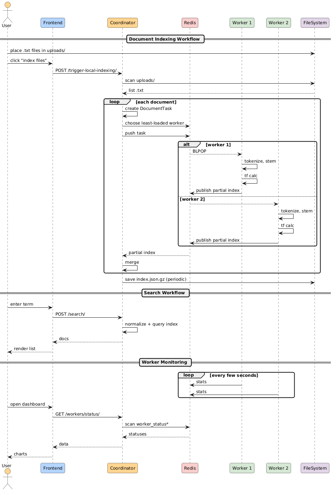

# KeySearch Project

KeySearch is a distributed document indexing and search system designed to process text documents, build an inverted index, and provide a fast keyword-based search.

## Architecture Overview


*   **Frontend (`src/`)**: A React-based single-page application (SPA) that provides the user interface for searching documents, viewing system status, and triggering administrative actions.
*   **Backend (`backend/`)**: Consists of a Coordinator, multiple Worker processes, and a Redis instance, all containerized using Docker.
    *   **Coordinator (`backend/coordinator`)**: A FastAPI application responsible for:
        *   Managing the global inverted index.
        *   Providing API endpoints for the frontend (search, indexing, status).
        *   Distributing document processing tasks to Workers via a Redis queue.
        *   Aggregating partial indexes from Workers.
        *   Persisting the index.
    *   **Workers (`backend/worker`)**: Python scripts that:
        *   Consume document processing tasks from a Redis queue.
        *   Perform text processing (tokenization, stemming, stopword removal) using NLTK.
        *   Calculate term frequencies (TF) for individual documents.
        *   Report their status and resource usage.
        *   Send processed partial indexes back to the Coordinator via Redis Pub/Sub.
    *   **Redis**: Acts as a message broker for task queuing (between Coordinator and Workers) and Pub/Sub communication (for results from Workers to Coordinator). It also stores worker status information.
    *   **Shared Utilities (`backend/shared`)**: Contains common code, like `text_utils.py` for natural language processing.

## 🛠️ Technologies Used

### 🖥️ Frontend


### 🔧 Backend


## Project Structure

```
keysearch/
├── backend/
│   ├── coordinator/            # Coordinator service (FastAPI app)
│   │   ├── app/                # Main application logic, models, API endpoints
│   │   ├── Dockerfile
│   │   └── requirements.txt
│   ├── worker/                 # Worker service (Python script)
│   │   ├── Dockerfile
│   │   └── requirements.txt
│   ├── shared/                 # Shared Python modules (e.g., text_utils)
│   ├── uploads/                # Default directory for local documents to be indexed
│   ├── .dockerignore
│   ├── docker-compose.yml      # Orchestrates backend services
│   └── README.md               # Backend specific README
├── public/                     # Static assets for Vite frontend
├── src/                        # Frontend React application source
│   ├── assets/                 # Images, logos for frontend
│   ├── components/             # React components (Dashboard, SearchResultCard, etc.)
│   ├── App.jsx                 # Main frontend application component
│   ├── App.css
│   ├── index.css               # Tailwind CSS and global styles
│   └── main.jsx                # Frontend entry point
├── .eslintrc.js                # ESLint configuration for frontend
├── index.html                  # Main HTML file for Vite
├── package.json                # Frontend dependencies and scripts
├── README.md
└── vite.config.js              # Vite configuration
```

## Workflow



### 1. Document Indexing

1.  **Trigger Indexing**:
    *   The user can place `.txt` files into the `backend/uploads/` directory (which is volume-mounted into the coordinator container at `/app/backend/uploads`).
    *   From the frontend, the user can click the "Index Files" button, which sends a `POST` request to the `/trigger-local-indexing/` endpoint on the Coordinator.
2.  **Coordinator Scans and Dispatches**:
    *   The Coordinator scans the specified directory (default: `/app/backend/uploads`) for `.txt` files.
    *   For each valid document, it creates a `DocumentTask` containing the document ID (filename) and its content.
    *   The Coordinator then determines the least loaded worker (based on queue length and resource usage reported in Redis) and pushes the `DocumentTask` (serialized as JSON) to that worker's specific Redis list (e.g., `doc_processing_tasks:worker-xyz-123`).
3.  **Worker Processing**:
    *   Each Worker continuously monitors its dedicated Redis task queue using `BLPOP`.
    *   When a task is received, the Worker:
        *   Deserializes the `DocumentTask`.
        *   Processes the document content using `shared.text_utils.normalize_text()`:
            *   Converts text to lowercase.
            *   Tokenizes the text.
            *   Removes stopwords (language-specific).
            *   Applies stemming to tokens (language-specific).
        *   Calculates the Term Frequency (TF) for the processed tokens, creating a partial index for that document (e.g., `{"termA": {"doc_id": countA}, ...}`).
4.  **Worker Reports Results**:
    *   The Worker sends this partial index, along with its `worker_id` and the `doc_id`, as a JSON payload to the Coordinator via a Redis Pub/Sub channel (`idx_partial_results`).
5.  **Coordinator Merges Index**:
    *   The Coordinator subscribes to the `idx_partial_results` Redis channel.
    *   Upon receiving a partial index, the Coordinator's `fuse.merge_partial_index()` function integrates it into the global in-memory inverted index. This index maps each term to a dictionary of document IDs and their frequencies (e.g., `{"termX": {"doc1.txt": freq1, "doc2.txt": freq2}}`).
6.  **Index Persistence**:
    *   The global index can be periodically or manually saved to a file (e.g., `/data/index.json.gz` inside the coordinator container, which can be volume-mounted for persistence) via the `/index/save/` endpoint. It can also be loaded via `/index/load/`.

### 2. Search Process

1.  **User Search**:
    *   The user types a keyword into the search bar on the frontend (`src/App.jsx`) and submits the search.
2.  **Frontend Sends Request**:
    *   The frontend sends a `POST` request to the Coordinator's `/search/` API endpoint with the search term in the JSON body (e.g., `{"term": "keyword"}`).
3.  **Coordinator Processes Query**:
    *   The Coordinator receives the search query.
    *   It normalizes the search term using `shared.text_utils.normalize_text()` (lowercase, tokenize, stem) similar to how document content is processed. This ensures that the search term matches the stemmed terms in the index.
4.  **Coordinator Queries Index**:
    *   The Coordinator looks up the stemmed search term in its global in-memory inverted index.
5.  **Results Returned to Frontend**:
    *   If the term is found, the Coordinator retrieves the list of document IDs and their corresponding frequencies for that term.
    *   These results are sorted by frequency (descending) and returned to the frontend as a JSON response (e.g., `{"docs": [["doc3.txt", 5], ["doc1.txt", 2]]}`).
6.  **Frontend Displays Results**:
    *   The frontend (`src/App.jsx`) receives the search results.
    *   It displays the results as a grid of `SearchResultCard` components, showing the document ID and the term frequency.
    *   Pagination is provided if there are many results.

### 3. Worker Status Monitoring

1.  **Worker Reporting**:
    *   Each Worker periodically (every 2 seconds) reports its status (CPU usage, RAM usage) to Redis. It writes this information to a specific key associated with its `worker_id` (e.g., `worker_status:worker-xyz-123`) and sets a Time-To-Live (TTL) on this key to indicate freshness.
2.  **Frontend Dashboard Request**:
    *   When the user navigates to the "Dashboard" view in the frontend (`src/components/Dashboard.jsx`), the frontend periodically sends `GET` requests to the Coordinator's `/workers/status/` API endpoint.
3.  **Coordinator Gathers Statuses**:
    *   The Coordinator queries Redis for all keys matching the `worker_status:*` pattern.
    *   For each active worker (whose status key has not expired), it retrieves the CPU, RAM, and queue length (by checking the length of the worker's specific task queue, e.g., `doc_processing_tasks:worker-xyz-123`).
4.  **Frontend Displays Dashboard**:
    *   The Coordinator returns a list of worker statuses to the frontend.
    *   The `Dashboard.jsx` component displays this information, typically showing each worker's ID, CPU usage, RAM usage, and current task queue length, often with visual indicators like progress bars.

## Setup and Running

### Prerequisites

*   **Node.js and npm (or yarn)**: For the frontend. (Check `package.json` for specific Node version if any, typically >= 16.x or 18.x)
*   **Docker and Docker Compose**: For the backend.

### Backend Setup

The backend services (Coordinator, Workers, Redis) are managed using Docker Compose.

1.  **Navigate to the `backend` directory:**
    ```bash
    cd backend
    ```

2.  **Build and Run Services:**
    To build the Docker images and start all services:
    ```bash
    docker-compose up --build
    ```
    This will start:
    *   Redis (port `6379`)
    *   Coordinator (port `8000`)
    *   2 Worker replicas by default (configurable in `docker-compose.yml` or via `--scale`)

    To run with a different number of workers (e.g., 4 workers):
    ```bash
    docker-compose up --build --scale worker=4
    ```

3.  **Accessing Coordinator API:**
    *   The Coordinator API will be available at `http://localhost:8000`.
    *   Interactive API documentation (Swagger UI) is typically available at `http://localhost:8000/docs`.

4.  **Local Document Uploads for Indexing:**
    *   Place `.txt` files you want to index into the `backend/uploads/` directory on your host machine. This directory is mounted into the Coordinator container.

5.  **Stopping Backend Services:**
    Press `Ctrl+C` in the terminal where `docker-compose up` is running. To remove containers and networks:
    ```bash
    docker-compose down
    ```
    To also remove persistent data volumes (like Redis data and the saved index):
    ```bash
    docker-compose down -v
    ```

For more details on backend configuration (environment variables, index persistence, etc.), refer to `backend/README.md` and `backend/docker-compose.yml`.

### Frontend Setup

1.  **Navigate to the project root directory** (where `package.json` for the frontend is located).

2.  **Install Dependencies:**
    ```bash
    npm install
    # or if you use yarn:
    # yarn install
    ```

3.  **Run the Development Server:**
    ```bash
    npm run dev
    # or
    # yarn dev
    ```
    This will start the Vite development server, typically at `http://localhost:5173` (check your terminal output).

4.  **Access the Application:**
    Open your browser and navigate to the URL provided by Vite (e.g., `http://localhost:5173`).

## Available Scripts

### Frontend

*   `npm run dev` or `yarn dev`: Starts the Vite development server.
*   `npm run build` or `yarn build`: Builds the frontend for production.
*   `npm run lint` or `yarn lint`: Lints the frontend code using ESLint.
*   `npm run preview` or `yarn preview`: Serves the production build locally for preview.

### Backend

*   `docker-compose up`: Starts all backend services defined in `docker-compose.yml`.
*   `docker-compose up --build`: Builds images if they don't exist or have changed, then starts services.
*   `docker-compose down`: Stops and removes containers, networks.
*   `docker-compose down -v`: Stops and removes containers, networks, and volumes.
*   `docker-compose logs -f [service_name]`: Follows logs for a specific service (e.g., `coordinator`, `worker`, `redis`).

## Configuration

*   **Backend**: Environment variables for Redis connection, language processing, log levels, etc., can be configured in `backend/docker-compose.yml`.
*   **Frontend**: The backend URL is configured in `src/App.jsx` (currently `http://localhost:8000`).