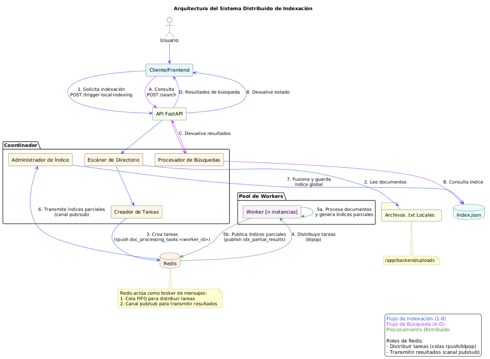

# Backend for Distributed Document Indexing System


This directory contains the backend services for the distributed document indexing and search system, as described in the project's `backend.md` file.

## Components

*   **Coordinator (`backend/coordinator`)**: A FastAPI application that:
    *   Manages the overall indexing process.
    *   Provides API endpoints for document uploading and keyword searching.
    *   Receives processed documents (partial indexes) from workers via Redis Pub/Sub.
    *   Merges partial indexes into a global in-memory inverted index.
    *   Persists the global index to `index.json`.
    *   Distributes document processing tasks to workers via a Redis queue.
*   **Worker (`backend/worker`)**: Python scripts that:
    *   Fetch document processing tasks from a Redis queue.
    *   Process the document content: tokenization, stopword removal, and stemming (supports English and Spanish, configurable).
    *   Calculate term frequencies (TF) for the document.
    *   Send the partial index (TF map) back to the coordinator via Redis Pub/Sub.
*   **Shared (`backend/shared`)**: Common utilities, primarily `text_utils.py` for text processing.
*   **Redis**: Used as a message broker for the task queue and Pub/Sub communication.

## Prerequisites

*   Docker
*   Docker Compose

## Setup & Running

1.  **Build and Run with Docker Compose:**

    Navigate to this `backend` directory in your terminal and run:

    ```bash
    docker-compose up --build
    ```

    This command will:
    *   Build the Docker images for the `coordinator` and `worker` services.
    *   Start the `redis`, `coordinator`, and `worker` services (2 worker replicas by default).

    To run more worker instances, you can use the `--scale` option:
    ```bash
    docker-compose up --build --scale worker=4 
    ```

3.  **Stopping the services:**

    Press `Ctrl+C` in the terminal where `docker-compose up` is running. To remove the containers and network:
    ```bash
    docker-compose down
    ```
    To also remove volumes (like Redis data):
    ```bash
    docker-compose down -v
    ```

## Coordinator API Endpoints

Once the coordinator service is running (default: `http://localhost:8000`), the following API endpoints are available:

*   **`POST /trigger-local-indexing/`**: Triggers indexing of `.txt` files from a local directory.
    *   **Request:** `multipart/form-data` with an optional `path` field. If `path` is not provided, it defaults to the `LOCAL_UPLOADS_PATH` configured in the coordinator.
    *   **Response (202 Accepted):** `StatusResponse` model indicating how many tasks were dispatched, and details about successful and failed files.
        ```json
        {
          "message": "Found X .txt files. Dispatched Y for indexing. Z file(s) failed processing locally.",
          "details": {
            "successful_dispatches": ["doc1.txt", "doc2.txt"],
            "failed_files": [["empty_file.txt", "Skipped: File is empty or whitespace only"]],
            "docs_currently_pending": 2
          }
        }
        ```

*   **`POST /search/`**: Search for a term in the indexed documents.
    *   **Request:** `SearchQuery` model (JSON body).
        ```json
        {"term": "your search keyword"}
        ```
    *   **Response:** `SearchResponse` model with documents containing the term, sorted by frequency.
        ```json
        {
          "docs": [
            ["doc3.txt", 5],
            ["doc1.txt", 2]
          ]
        }
        ```

*   **`GET /index-status/`**: Get the current status of the index.
    *   **Response:** `StatusResponse` model.
        ```json
        {
          "message": "Current index status.",
          "details": {
            "total_terms_in_index": 1205,
            "documents_pending_results": 0
          }
        }
        ```

*   **`POST /index/save/`**: Manually trigger saving the global index to `index.json`.
    *   **Response:** `StatusResponse` model.

*   **`POST /index/load/`**: Manually trigger reloading the global index from `index.json`.
    *   **Response:** `StatusResponse` model.

*   **`GET /healthz`**: Simple health check endpoint.
    *   **Response (200 OK):**
        ```json
        {
          "status": "healthy",
          "message": "Coordinator is running"
        }
        ```

*   **`GET /workers/status/`**: Retrieves the current status of all registered workers.
    *   **Response:** `AllWorkersStatusResponse` model.
        ```json
        {
          "workers": [
            {
              "worker_id": "worker-hostname-pid1",
              "cpu_percent": 10.5,
              "ram_percent": 25.0,
              "status_ttl_seconds": 5,
              "queue_length": 0
            },
            {
              "worker_id": "worker-hostname-pid2",
              "cpu_percent": 5.2,
              "ram_percent": 30.1,
              "status_ttl_seconds": 6,
              "queue_length": 2
            }
          ]
        }
        ```

Interactive API documentation (Swagger UI) is usually available at `http://localhost:8000/docs` when the coordinator is running.

## Notes

*   **Index Persistence**: The global index is saved as `index.json` inside the `backend/coordinator/app/` directory (when running via Docker Compose with the provided volume mount for development) or within the container if not mounted. Redis data is persisted using a Docker volume.
*   **Language Processing**: Text processing (stemming, stopwords) defaults to English but can be configured for Spanish. See `PROCESSING_LANGUAGE` and `COORDINATOR_PROCESSING_LANGUAGE` environment variables. 