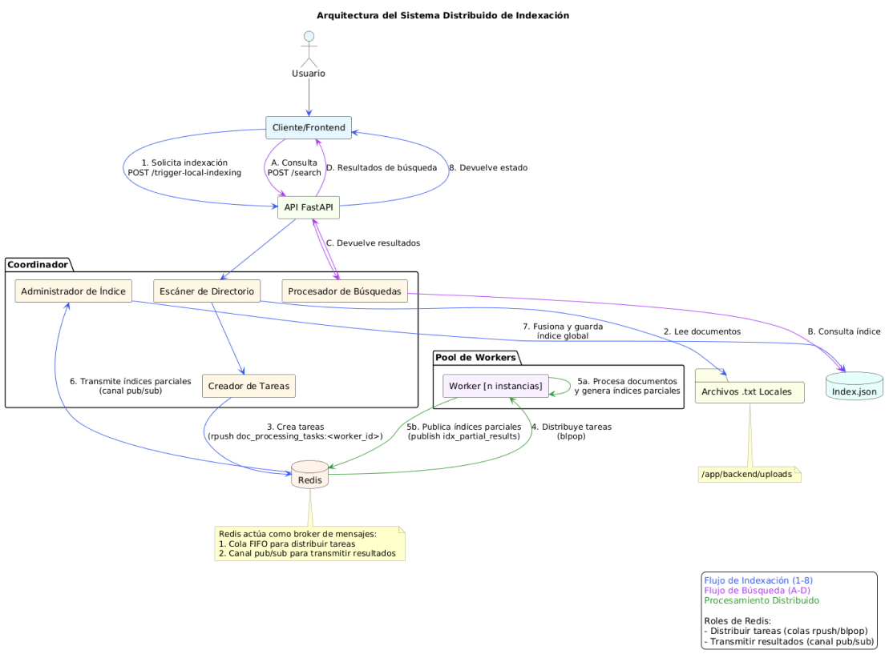

# Arquitectura del Sistema Distribuido de Indexación



# Backend del Sistema Distribuido de Indexación de Documentos

Este directorio contiene los servicios de backend para el sistema distribuido de indexación y búsqueda de documentos, como se describe en el archivo `backend.md` del proyecto.

## Componentes

*   **Coordinador (`backend/coordinator`)**: Una aplicación FastAPI que:
    *   Gestiona el proceso general de indexación.
    *   Proporciona endpoints API para la carga de documentos y la búsqueda de palabras clave.
    *   Recibe documentos procesados (índices parciales) de los workers a través de Redis Pub/Sub.
    *   Fusiona los índices parciales en un índice invertido global en memoria.
    *   Persiste el índice global en `index.json`.
    *   Distribuye las tareas de procesamiento de documentos a los workers a través de una cola de Redis.
*   **Worker (`backend/worker`)**: Scripts de Python que:
    *   Obtienen tareas de procesamiento de documentos de una cola de Redis.
    *   Procesan el contenido del documento: tokenización, eliminación de stopwords y stemming (admite inglés y español, configurable).
    *   Calculan las frecuencias de términos (TF) para el documento.
    *   Envían el índice parcial (mapa TF) de vuelta al coordinador a través de Redis Pub/Sub.
*   **Shared (`backend/shared`)**: Utilidades comunes, principalmente `text_utils.py` para el procesamiento de texto.
*   **Redis**: Se utiliza como un intermediario de mensajes para la cola de tareas y la comunicación Pub/Sub.

## Prerrequisitos

*   Docker
*   Docker Compose

## Configuración y Ejecución

1.  **Construir y Ejecutar con Docker Compose:**

    Navega a este directorio `backend` en tu terminal y ejecuta:

    ```bash
    docker-compose up --build
    ```

    Este comando:
    *   Construirá las imágenes de Docker para los servicios `coordinator` y `worker`.
    *   Iniciará los servicios `redis`, `coordinator` y `worker` (2 réplicas de worker por defecto).

    Para ejecutar más instancias de worker, puedes usar la opción `--scale`:
    ```bash
    docker-compose up --build --scale worker=4
    ```

3.  **Detener los servicios:**

    Presiona `Ctrl+C` en la terminal donde se está ejecutando `docker-compose up`. Para eliminar los contenedores y la red:
    ```bash
    docker-compose down
    ```
    Para eliminar también los volúmenes (como los datos de Redis):
    ```bash
    docker-compose down -v
    ```

## Endpoints de la API del Coordinador

Una vez que el servicio coordinador está en ejecución (por defecto: `http://localhost:8000`), los siguientes endpoints de la API están disponibles:

*   **`POST /trigger-local-indexing/`**: Activa la indexación de archivos `.txt` desde un directorio local.
    *   **Solicitud:** `multipart/form-data` con un campo opcional `path`. Si no se proporciona `path`, se utiliza por defecto el `LOCAL_UPLOADS_PATH` configurado en el coordinador.
    *   **Respuesta (202 Accepted):** Modelo `StatusResponse` que indica cuántas tareas se despacharon y detalles sobre los archivos exitosos y fallidos.
        ```json
        {
          "message": "Se encontraron X archivos .txt. Se despacharon Y para indexación. Z archivo(s) fallaron en el procesamiento local.",
          "details": {
            "successful_dispatches": ["doc1.txt", "doc2.txt"],
            "failed_files": [["empty_file.txt", "Omitido: El archivo está vacío o solo contiene espacios en blanco"]],
            "docs_currently_pending": 2
          }
        }
        ```

*   **`POST /search/`**: Busca un término en los documentos indexados.
    *   **Solicitud:** Modelo `SearchQuery` (cuerpo JSON).
        ```json
        {"term": "tu palabra clave de búsqueda"}
        ```
    *   **Respuesta:** Modelo `SearchResponse` con los documentos que contienen el término, ordenados por frecuencia.
        ```json
        {
          "docs": [
            ["doc3.txt", 5],
            ["doc1.txt", 2]
          ]
        }
        ```

*   **`GET /index-status/`**: Obtiene el estado actual del índice.
    *   **Respuesta:** Modelo `StatusResponse`.
        ```json
        {
          "message": "Estado actual del índice.",
          "details": {
            "total_terms_in_index": 1205,
            "documents_pending_results": 0
          }
        }
        ```

*   **`POST /index/save/`**: Activa manualmente el guardado del índice global en `index.json`.
    *   **Respuesta:** Modelo `StatusResponse`.

*   **`POST /index/load/`**: Activa manualmente la recarga del índice global desde `index.json`.
    *   **Respuesta:** Modelo `StatusResponse`.

*   **`GET /healthz`**: Endpoint simple de verificación de estado.
    *   **Respuesta (200 OK):**
        ```json
        {
          "status": "healthy",
          "message": "El Coordinador está funcionando"
        }
        ```

*   **`GET /workers/status/`**: Recupera el estado actual de todos los workers registrados.
    *   **Respuesta:** Modelo `AllWorkersStatusResponse`.
        ```json
        {
          "workers": [
            {
              "worker_id": "worker-hostname-pid1",
              "cpu_percent": 10.5,
              "ram_percent": 25.0,
              "status_ttl_seconds": 5,
              "queue_length": 0
            },
            {
              "worker_id": "worker-hostname-pid2",
              "cpu_percent": 5.2,
              "ram_percent": 30.1,
              "status_ttl_seconds": 6,
              "queue_length": 2
            }
          ]
        }
        ```

La documentación interactiva de la API (Swagger UI) suele estar disponible en `http://localhost:8000/docs` cuando el coordinador está en ejecución.

## Notas

*   **Persistencia del Índice**: El índice global se guarda como `index.json` dentro del directorio `backend/coordinator/app/` (cuando se ejecuta a través de Docker Compose con el montaje de volumen proporcionado para desarrollo) o dentro del contenedor si no está montado. Los datos de Redis se persisten usando un volumen de Docker.
*   **Procesamiento de Lenguaje**: El procesamiento de texto (stemming, stopwords) utiliza por defecto inglés, pero se puede configurar para español. Consulta las variables de entorno `PROCESSING_LANGUAGE` y `COORDINATOR_PROCESSING_LANGUAGE`. 